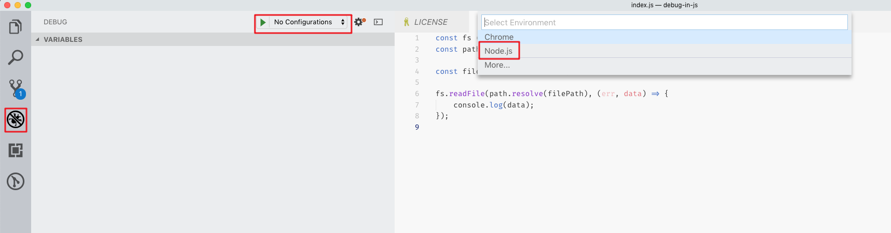
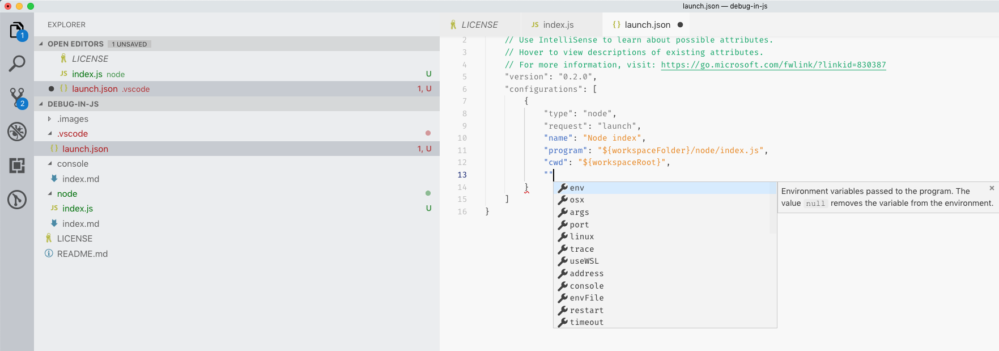
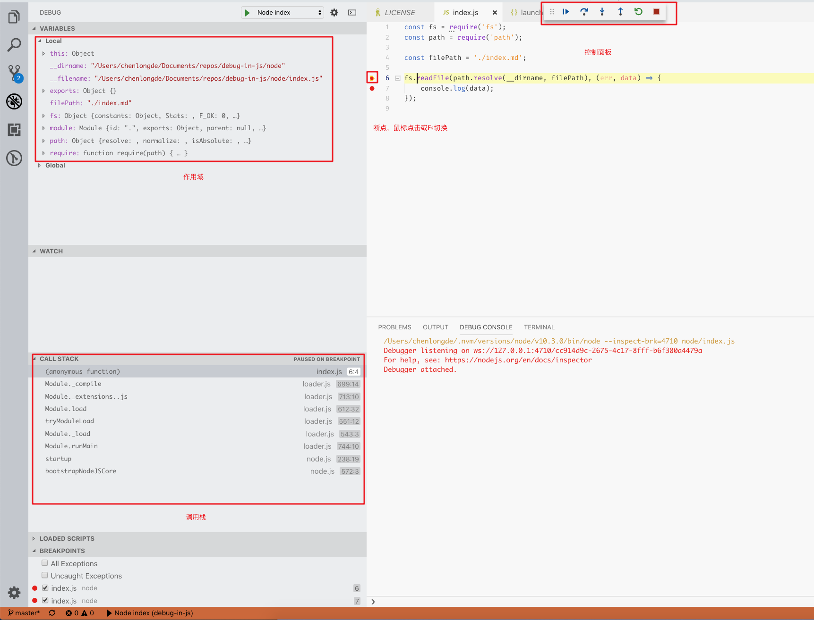
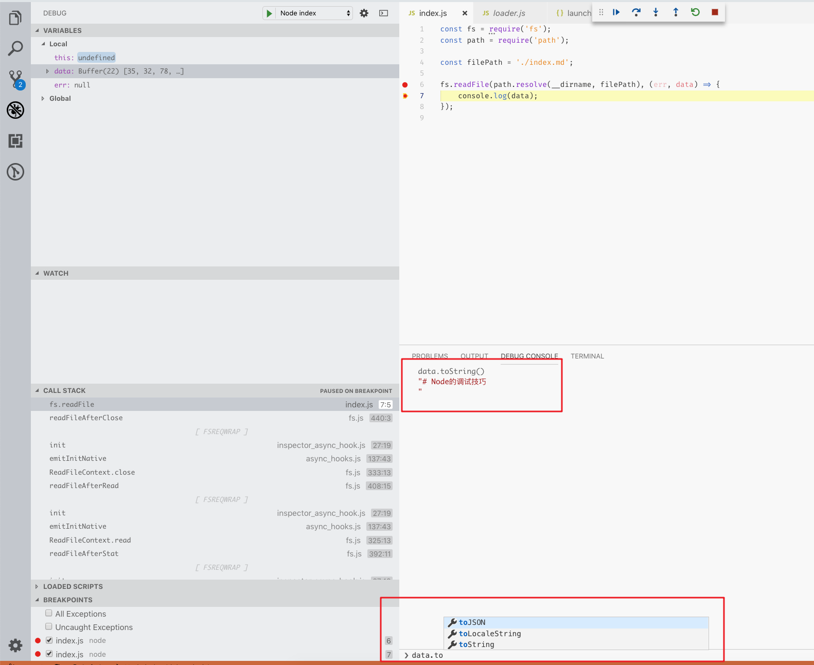
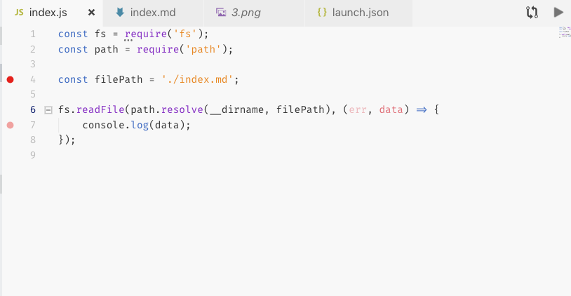

# Node的调试技巧

基于node-inspector服务，VSCODE支持直接在编辑器内断点调试

## 1. 打开调试面板，新建node环境调试

## 2. 配置调试参数

大部分参数可联想，详情说明见上面的microsoft.com链接[https://go.microsoft.com/fwlink/?linkid=830387](https://go.microsoft.com/fwlink/?linkid=830387)

## 3. 执行调试，调试面板点击按钮或快捷键（F5）

## 4. 调试信息，可以在控制台查看

## 5. 添加删除断点

可以在代码编辑器的右侧鼠标点击切换或快捷键（F9）

